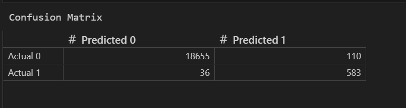
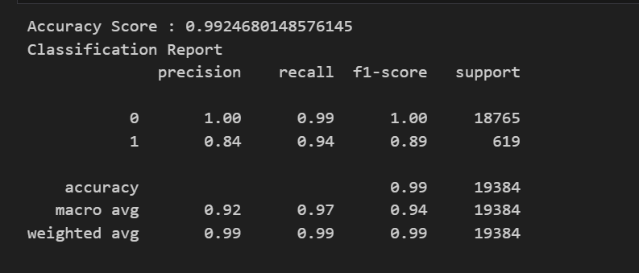

## Overview of the Analysis

The purpose of this Analysis is to use a dataset of historical lending activity from a peer-to-peer lending services company to build a model that can identify the creditworthiness of borrowers.
The objective is to categorize loans into two groups: 0 for "healthy loans" and 1 for "high-risk loans."
The dataset includes various variables, such as loan size, interest rate, borrower income, total debt, and more. These features will be utilized to predict whether a loan is likely to be a healthy loan or a high-risk loan.

## Stages of the machine learning process
    import the dataset
    Create lable(y) and feature set(X) from Dataset
    Split data inti training and testing set
    Logistic Regression Model with Train Data
    Made prediction on Test Data
    Evalute the performance by confusion matrix
    Display the accuracy report

## Results

    18655 healthy loans were classified correctly.
    583 high risk loans were classified correctly.
    110 healthy loans were incorrectly classified as high risk.
    36 high risk loans were incorrectly classified as healthy.

    Accuracy Score: 0.99
    The model achieved an accuracy of 99%, meaning it correctly classified 99% of the loans in the dataset.

    Precision for Class 0 (Healthy Loan): 1.00
    The precision for class 0 (healthy loans) is perfect, indicating that the model can predict healthy loans with 100% accuracy, without misclassifying any high-risk loans      as healthy.

    Recall for Class 0 (Healthy Loan): 0.99
    The recall for class 0 is 99%, meaning the model successfully identified 99% of the actual healthy loans, with only a small number of false negatives.

    F1-score for Class 0:1
    F1-score 1 means precision and Recall has perfect balance and class 0 is perfect.

    Precision for Class 1 (High-Risk Loan): 0.84
    The precision for class 1 (high-risk loans) is 84%, meaning that when the model predicts a loan as high-risk, it is correct 84% of the time. However, 16% of the high-        risk predictions are false positives (healthy loans incorrectly classified as high-risk).

    Recall for Class 1 (High-Risk Loan): 0.94
    The recall for class 1 is 94%, meaning the model correctly identified 94% of the actual high-risk loans, effectively minimizing false negatives (missed high-risk loans).

    F1-Score for Class 1 (High-Risk Loan): 0.89
    The F1-score for class 1 is 0.89, indicating a strong balance between precision and recall. While the model performs well, there is still room for improvement in             precision to reduce false positives.

    The macro averages give a general view of the model's performance across both classes, without considering class imbalance. The model performs relatively well with a         higher recall value, meaning that it does a good job of identifying positive samples across both classes, although the precision is slightly lower.
    
    The weighted averages take into account the class imbalance, with class 0 heavily influencing the overall scores. The model performs exceptionally well across all             metrics, as indicated by the high weighted averages, particularly in terms of precision, recall, and F1-score.

## Summary

The logistic regression model is highly effective, especially for healthy-loan classification. It also shows strong potential in identifying high-risk loans with minimal errors. These results suggest that the model is well-suited for real-world loan approval scenarios, where minimizing defaulters while ensuring reliable predictions is key.
